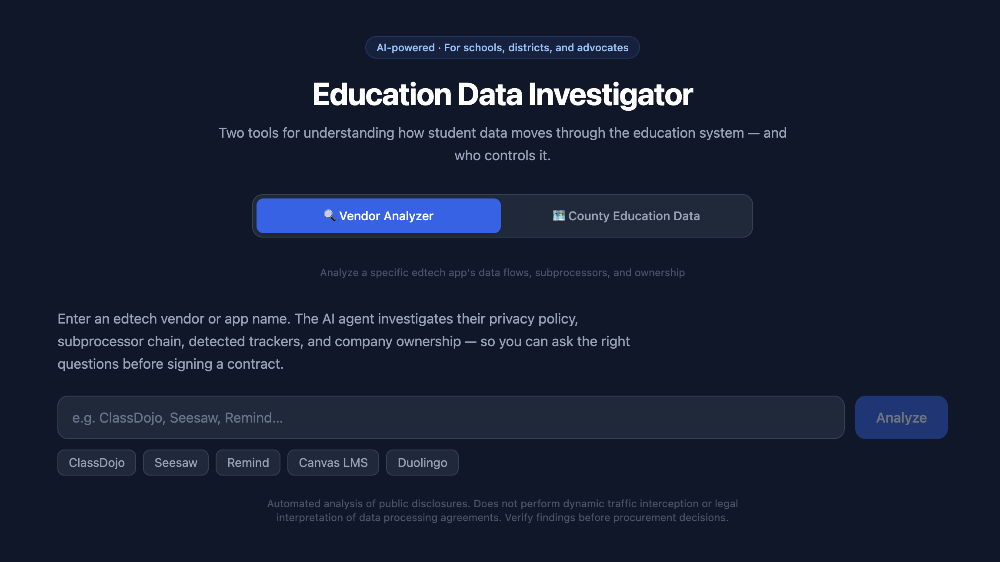
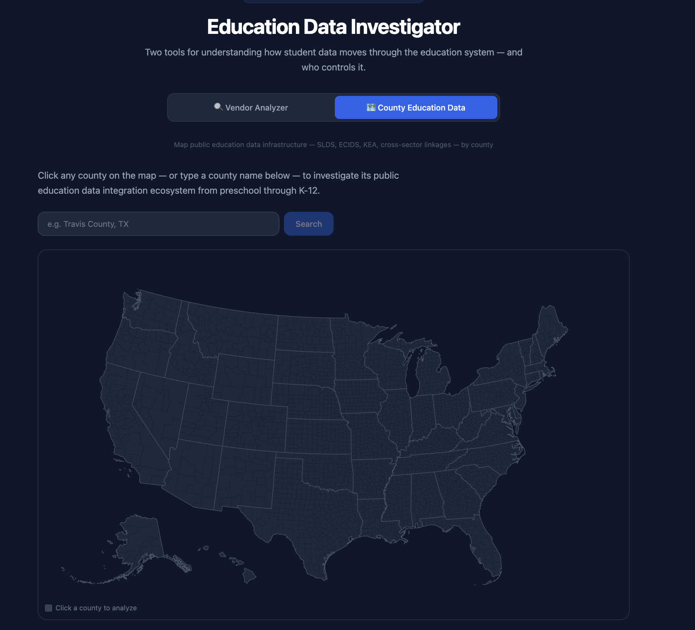

# Vendor Data Flow Analyzer

An AI-powered research and accountability tool with two investigation modes: map how student data flows through individual edtech vendors, and map the public education data infrastructure serving any US county — giving procurement officers, researchers, and advocates the investigative infrastructure to ask better questions and hold institutions accountable.

---

## The Problem

Schools are among the most data-rich environments in the modern economy, yet among the least resourced when it comes to evaluating what happens to that data. The asymmetry runs in two directions.

**At the vendor level:** Every edtech tool arrives with a privacy policy, a data processing agreement, and a subprocessor list — dense, inconsistent documents written by legal teams whose job is to protect the vendor, not the student. The person evaluating them is often a single district administrator with an afternoon and no legal support. Children's personal data — academic records, behavioral data, learning profiles, and in some cases biometric data — flows into commercial pipelines that were never disclosed to parents or schools. AI tools embedded in edtech products routinely process student-generated content in ways not mentioned in any privacy policy. Acquisitions silently transfer student data to new corporate parents without notice to the districts that originally agreed to the terms.

**At the infrastructure level:** Education data integration in the US operates through a layered system of state longitudinal data systems, early childhood databases, kindergarten entry assessments, and cross-sector linkages to workforce, health, juvenile justice, and military data — most of which are invisible to parents, school board members, and even many administrators. These systems are mandated at the state level, operated by private vendors under government contracts, and connect student records to data systems that follow a child from preschool through employment.

This tool addresses both dimensions of that accountability gap.

---

## Two Investigation Modes

### Mode 1 — Vendor Data Flow Analysis



Enter a vendor or app name — ClassDojo, Seesaw, Duolingo, Remind. The AI agent investigates public disclosures, static analysis databases, app store privacy labels, and technology detection sources, then returns a structured report in 1–2 minutes.

**What the report includes:**

- **Risk summary** — Risk-level assessment (Elevated / Standard / Low Concern) with four headline metrics: direct subprocessors, estimated downstream vendors, detected trackers, and discrepancies between declared and detected practices
- **Data flow diagram** — Visual map of the full data ecosystem organized by layer: upstream infrastructure, analytics SDKs, advertising trackers, authentication services, LMS integrations, rostering services, student information systems, and state education data pipelines
- **Company ownership** — Who actually owns the vendor: parent company, acquisition history, private equity involvement — often the most important finding for long-term data governance
- **Subprocessor table** — Every identified vendor with data access: purpose, data types, country of operation, and whether they were disclosed by the vendor or independently detected
- **Discrepancies flagged** — Side-by-side comparison of declared versus detected third parties, severity-ranked. This is the section that changes procurement conversations.
- **Tracker detection** — Embedded tracking SDKs found inside the app's compiled Android code via Exodus Privacy static analysis
- **Vendor questions** — 5–8 specific, pointed questions generated from actual gaps in the vendor's disclosures, not boilerplate
- **Citations** — Every major finding links to a source the agent actually visited

**What the agent investigates:**

The agent runs a 30-step research protocol across six phases: official disclosure documents (privacy policy, DPA, subprocessor list, App Store privacy label, Play Store Data Safety section), infrastructure (cloud hosting, CDN), analytics and AI/ML tools (embedded SDKs, generative AI integrations), communication and video tools, downstream integrations (Clever, ClassLink, Google Classroom, Canvas, PowerSchool, Infinite Campus), and company ownership.

---

### Mode 2 — County Education Data Systems



Select any US county on an interactive map. The AI agent researches the public education data integration infrastructure serving that county — from early childhood through K-12 and into post-secondary workforce connections — and returns a structured report on what data systems exist, which vendors built and operate them, and what protections or gaps apply.

**What the report includes:**

- **Education systems inventory** — Every identified data system with scope (county, state, or federal), status, data elements collected, and the technology vendor that built or operates it
- **Cross-sector linkages** — Data connections beyond education: workforce and learning-employment records (LER), health and Medicaid data linkages, juvenile justice records, military family data, migrant student tracking (MSIX)
- **Safeguards and gaps** — Applicable federal laws (FERPA, COPPA, PPRA, ESSA), state student privacy statutes with citation, and explicit identification of where protections are absent or weak
- **Key findings** — 4–6 substantive findings about what is collected, shared, and with whom
- **Questions to ask** — 5–8 specific questions for a school board member, parent advocate, or journalist based on actual gaps found

**What the agent investigates:**

The agent researches seven categories: the state's Statewide Longitudinal Data System (SLDS/P-20W) and its vendor contracts, Early Childhood Integrated Data Systems (ECIDS), Kindergarten Entry Assessment instruments and policy, cross-sector data linkages, federal reporting connections (EdFacts, NAEP, Head Start), technology vendors and procurement contracts (Tyler Technologies, Infinite Campus, PowerSchool, eScholar, DXC Technology, Deloitte), and state privacy law.

Because education data integration is mandated at the state level, the report covers the state systems that every county participates in, plus district-specific implementations for major urban counties.

---

## Significance as a Research and Accountability Tool

### EdTech Accountability

The edtech industry operates in a trust gap: schools trust that vendors are complying with their stated data practices, and vendors trust that schools are not looking closely enough to notice when they aren't. This tool makes looking closely cheap enough that it can happen routinely, not just when a breach or lawsuit forces the issue.

By surfacing the full subprocessor chain — the network of vendors that handle student data downstream of the primary vendor — the tool makes visible a part of the edtech data economy that has been effectively invisible. When a school contracts with a learning management system, it may unknowingly be contracting with dozens of analytics providers, an AI model training pipeline, and a cloud infrastructure stack that collectively have more access to student data than the vendor itself.

### Children's Privacy and Human Rights

Children's data is categorically more sensitive than adult data. Children cannot consent on their own behalf. Their data, once collected, can follow them for decades — through college admissions, employment screening, credit decisions, and insurance underwriting systems that may incorporate behavioral and academic profiles from childhood. The legal frameworks that exist impose obligations, but enforcement is reactive and resource-constrained.

This tool operationalizes preventive scrutiny. By detecting undisclosed trackers, identifying AI/ML tools processing student-generated content, flagging ownership changes, and mapping the full downstream infrastructure from a classroom app to a state education data warehouse, it gives advocates, parents, researchers, and policy makers the raw material to identify compliance failures before they become harms.

The county education data mode extends this to the public infrastructure layer — making the surveillance architecture of American education visible in a form legible to non-technical stakeholders: parents, journalists, school board members, and civil liberties researchers.

### AI Governance

The deployment of AI and machine learning tools inside edtech products is one of the most significant and least disclosed developments in the sector. AI-powered grading, adaptive learning, behavioral monitoring, and content generation tools process student work, capture interaction patterns, and in some cases use that data to train or fine-tune models. Privacy policies written before the current generation of AI tools rarely adequately disclose these uses.

The vendor analysis specifically investigates AI and ML tool use: searching for OpenAI, Anthropic, Google Gemini, and other model provider integrations; checking engineering blogs, job listings, and technical documentation; and flagging any AI vendor found in the subprocessor chain that was not disclosed in the privacy policy. Generated vendor questions specifically address model training data use, data residency, and opt-out rights for any AI tool detected.

### Procurement Officers and Institutional Decision-Making

The primary practical audience is the person who has to make a procurement decision — often without technical background in data systems, without legal support, and without time. This tool gives them:

- A dossier on the vendor, ready before the pitch meeting
- Specific questions the vendor must answer, derived from actual findings
- A visual map of the data ecosystem they are authorizing
- A flag when the vendor's parent company has changed since the original contract
- An honest list of what still requires human verification before signing

For the county mode, it gives school board members, district technology directors, and state procurement offices a map of the data infrastructure their constituents' children are already enrolled in — with explicit identification of vendor contracts and governance gaps.

### Research and Policy

For researchers studying the edtech data economy or public education surveillance infrastructure, both modes provide a repeatable, documented methodology. The citation system records every source visited, creating an auditable research trail. The structured output format enables systematic comparison across vendors, counties, states, and time.

For policy makers, the tools surface patterns that are difficult to see in individual evaluations but become visible at scale: which analytics providers appear across most edtech tools, which AI services are embedded without disclosure, which state longitudinal data systems lack adequate safeguards, and which cross-sector linkages have no articulated legal basis.

---

## How It Works

Both modes use a Google Gemini 2.5 Flash AI agent with web search and page fetch tools. The agent runs a structured research protocol, makes 20–40 tool calls per analysis, and produces a structured JSON report rendered in the UI.

| Tool | What it does |
|---|---|
| `search_web` | Brave Search API — finds documents, contracts, news, and technical disclosures |
| `fetch_page` | Fetches and strips HTML — reads the actual documents |
| `lookup_exodus` | Queries Exodus Privacy for detected trackers in the Android APK (vendor mode only) |
| `lookup_appstore` | Queries iTunes Search API for App Store metadata (vendor mode only) |

### What neither mode can do

- **Dynamic traffic analysis**: Observing live data transmission requires a physical test device and tools like mitmproxy. The agent can prepare a test plan but cannot perform the capture.
- **Legal interpretation**: The tool flags potential issues. Whether they are legally adequate under FERPA/COPPA for a specific district's context requires counsel.
- **Vendor intent**: The tool reports what is and isn't disclosed. It does not adjudicate whether undisclosed practices are intentional or negligent.
- **Real-time data**: Analysis reflects public disclosures as of the analysis date.

---

## Setup

### Prerequisites

- Node.js 18+
- A [Google Gemini API key](https://aistudio.google.com)
- A [Brave Search API key](https://brave.com/search/api/) — free tier (2,000 queries/month) is sufficient

### Installation

```bash
git clone https://github.com/royapakzad/vendor-data-flow.git
cd vendor-data-flow
npm install
cp .env.local.example .env.local
```

Edit `.env.local` and add your keys:

```
GEMINI_API_KEY=...
BRAVE_SEARCH_API_KEY=BSA...
```

```bash
npm run dev
```

Open [http://localhost:3000](http://localhost:3000).

### Deploying to Vercel

[](https://vercel.com/new/clone?repository-url=https://github.com/royapakzad/vendor-data-flow)

Add `GEMINI_API_KEY` and `BRAVE_SEARCH_API_KEY` as environment variables in your Vercel project settings. The Vercel free tier's 60-second function timeout may be hit on longer analyses — upgrading to Pro (300s timeout) is recommended for production use.

---

## Tech Stack

- **Next.js 14** (App Router) — frontend and API routes
- **Google Gemini 2.5 Flash** — AI agent with tool use and multi-step research
- **Mermaid.js** — client-side data flow diagram rendering
- **react-simple-maps** — interactive US county map
- **Tailwind CSS** — styling
- **Exodus Privacy API** — Android tracker detection
- **iTunes Search API** — App Store metadata (no key required)
- **Brave Search API** — web search

---

## Limitations and Honest Notes

This tool produces findings from public disclosures, static analysis, and web-accessible documents. It does not have access to vendor internal systems, audit logs, or government contract databases that require registration. Vendor documents can be updated at any time; this tool reads them as of the analysis date.

The subprocessor chain expansion is one level deep for most vendors. Discrepancy flagging is probabilistic — a tracker SDK appearing in Exodus but not in a subprocessor list may have a legitimate explanation. For the county mode, state-level data on vendor contracts is often incomplete or unavailable in public sources; the agent explicitly notes when findings are inferred versus verified.

Use findings as a starting point for questions and further investigation, not as evidence of wrongdoing.

---

## Context

Built to address the structural asymmetry between the institutions that collect and process student data and the communities whose children that data belongs to. The goal is not to replace legal counsel or technical audits, but to make the preliminary investigative work cheap enough and fast enough that it becomes a standard part of how schools, researchers, and advocates evaluate the systems they operate within.

Student data deserves the same scrutiny that financial data gets in banking and medical data gets in healthcare. This tool is a step toward making that scrutiny routine.

---

## License

MIT
